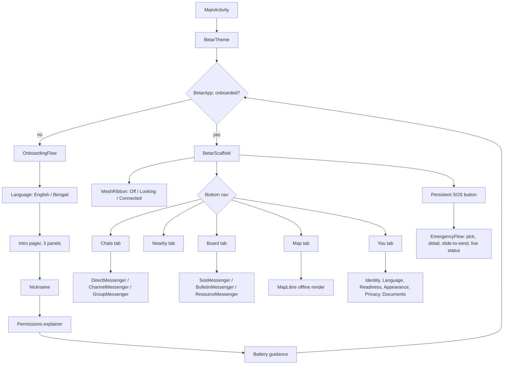

# Architecture

Detailed system architecture for Project Mesh. Companion to `WHITEPAPER.md` §5.

---

## 1. Principles

1. **One brain, many faces.** All security- and protocol-critical logic lives once, in a shared
   Rust core. Front-ends are thin.
2. **Native at the edges.** UI and radio drivers are native per platform (Kotlin/Compose,
   Swift/SwiftUI), because that is where OS-specific behaviour and reliability live.
3. **The native layer is a dumb byte pipe.** It carries opaque buffers; it makes no crypto or
   routing decisions.
4. **Untrusted input is parsed in Rust.** All wire parsing happens in the memory-safe core.
5. **No proprietary cloud in the core.** The core has zero dependency on Google/Apple services.

## 2. Layers

```
┌─────────────────────────────────────────────────────────────────┐
│ Presentation (native)                                            │
│  Android: Jetpack Compose        iOS: SwiftUI                     │
│  screens, navigation, accessibility, localization rendering      │
├─────────────────────────────────────────────────────────────────┤
│ Platform services (native)                                       │
│  foreground service / background modes, local notifications,     │
│  keystore/Secure Enclave access, permission handling,            │
│  MapLibre rendering surface, radio drivers                       │
├─────────────────────────────────────────────────────────────────┤
│ FFI boundary (UniFFI-generated Kotlin & Swift bindings)          │
├─────────────────────────────────────────────────────────────────┤
│ Shared core (Rust)                                               │
│   ┌───────────────┐ ┌───────────────┐ ┌───────────────────────┐  │
│   │ crypto        │ │ mesh engine   │ │ app domain            │  │
│   │ identity      │ │ envelopes     │ │ SOS / bulletin        │  │
│   │ Noise XX      │ │ store-carry-  │ │ resource board        │  │
│   │ Double Ratchet│ │  forward      │ │ chat / channels /grp  │  │
│   │ sealing/AEAD  │ │ dedup + TTL   │ │ map pins              │  │
│   │ onion (Sphinx)│ │ scheduler     │ │ contacts / trust      │  │
│   └───────────────┘ └───────────────┘ └───────────────────────┘  │
│   ┌───────────────────────────────────────────────────────────┐  │
│   │ persistence: SQLCipher (encrypted SQLite)                 │  │
│   └───────────────────────────────────────────────────────────┘  │
│   ┌───────────────────────────────────────────────────────────┐  │
│   │ radio abstraction trait: advertise/scan/connect/send/recv │  │
│   └───────────────────────────────────────────────────────────┘  │
└─────────────────────────────────────────────────────────────────┘
```

### 2.1 Android UI navigation

The presentation layer's actual screen graph, `android/app/src/main/java/india/projectmesh/app/ui/`:



Every leaf under Chats/Board wires to the same real Rust-core-backed messengers
`MeshApplication` exposes, not a separate mock data layer; Nearby's per-device list and Map's
pin-over-mesh sharing are the two spots without a real backend yet, stated plainly in each
screen's own code comments rather than faked as live (`docs/IMPLEMENTATION-STATUS.md` tracks
both). See `docs/DESIGN-BRIEF.md` §8-9 for what each screen is for and `docs/PROGRESS.md`'s
2026-07-26 entries for how this pass was actually verified on-device.

## 3. The radio abstraction

The core defines a transport-agnostic interface the native layer implements. Conceptually:

```rust
/// Implemented by each platform's native radio driver and passed into the core.
pub trait MeshTransport: Send + Sync {
    /// Begin advertising presence and scanning for peers.
    fn start(&self, service: ServiceId) -> Result<()>;
    fn stop(&self) -> Result<()>;
    /// Send an opaque frame to a connected peer.
    fn send(&self, peer: PeerHandle, frame: &[u8]) -> Result<()>;
    /// Native driver calls back into the core on these events.
    // on_peer_discovered(peer, rssi)
    // on_peer_connected(peer)
    // on_frame(peer, bytes)
    // on_peer_lost(peer)
}
```

Multiple transports (BLE, Wi-Fi Direct/Aware, MultipeerConnectivity, LoRa bridge) can be active
at once; the core treats them as a pool of links and does not care which physical medium a frame
arrived on.

## 4. Threading and lifecycle

- The core runs its scheduler on a dedicated worker (async runtime in Rust, e.g. Tokio or a
  hand-rolled executor) and communicates with the UI via events across the FFI boundary.
- On **Android**, a **foreground service** with an ongoing notification hosts the mesh engine so
  it survives while the app is backgrounded; OEM battery-manager whitelisting guidance is shown
  to the user.
- On **iOS**, the engine runs in the foreground and within the limited background execution
  Apple allows; the design assumes iOS relays chiefly in the foreground ("relay mode").

## 5. Persistence

- **SQLCipher** (encrypted SQLite) stores envelopes, session state, contacts, and app data.
- The database key is stored in the platform keystore (Android Keystore / iOS Keychain +
  Secure Enclave) and optionally wrapped by a user passphrase.
- Envelope store is size-bounded with priority-aware eviction (see `ROUTING-PROTOCOL.md`).

## 6. Build and bindings

- Core built as a static/dynamic library per target (`aarch64` Android, `arm64` iOS, plus
  emulator/simulator targets and desktop for tests).
- **UniFFI** generates the Kotlin and Swift bindings from a single interface definition,
  keeping the FFI surface small and typed.
- Deterministic, **reproducible builds** are a first-class requirement (see `DISTRIBUTION.md`).

## 7. Testing strategy

- Pure-Rust unit and property tests for crypto, parsing, dedup, and TTL logic.
- A **simulation harness** that instantiates many virtual nodes with a synthetic mobility and
  contact model to measure delivery ratio and latency versus density (DTN evaluation).
- Fuzzing of all wire parsers (untrusted input).
- Instrumented on-device tests for radio drivers on representative low-end Android hardware.
